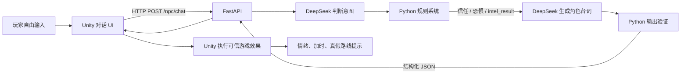
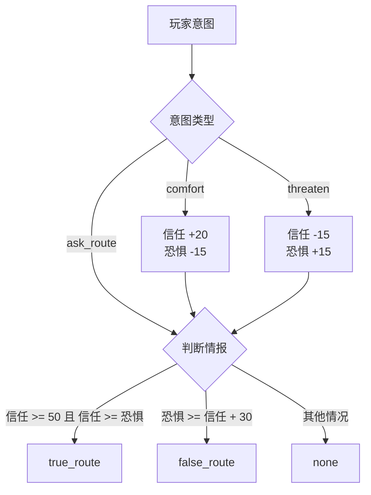

# AI NPC 设计文档

## 文档用途

本文档记录《囚城营救》AI NPC 系统的产品目标、数据结构、接口约定和迭代路线。

## AI NPC 总体设计

AI NPC 不只是聊天机器人。NPC 的对话应与游戏状态和玩家行动产生联系，并能影响路线、任务或情报。

第一位 AI NPC 建议设置为掌握隐藏路线情报的角色。玩家通过对话影响其信任度；满足条件后，NPC 才会透露隐藏路线，Unity 随后开启隐藏通道或任务提示。

系统职责划分：

| 模块 | 负责内容 |
| --- | --- |
| Unity | 展示对话、维护可信游戏状态、执行开门或任务更新 |
| FastAPI | 接收请求、组织 NPC 上下文、调用模型、验证输出 |
| 大模型 | 根据角色设定与上下文生成语言和受约束的行为建议 |
| 记忆模块 | 保存与检索玩家和 NPC 的重要历史互动 |
| RAG 知识库 | 提供世界观、角色、地图和任务设定 |

## NPC 基础数据

每个 NPC 至少应包含：

```json
{
  "npc_id": "prisoner_001",
  "name": "待命名",
  "identity": "知道隐藏路线的囚犯",
  "personality": "谨慎，对陌生人缺乏信任",
  "goal": "逃离城堡并确保自身安全",
  "secret": "知道一条通往吕归尘关押区域的隐藏路线",
  "current_state": "被关押",
  "trust": 20,
  "history": []
}
```

## 第一阶段目标：最小可展示版本

- 玩家可以在 Unity 中输入对话
- NPC 根据身份、性格、目标与秘密回答
- AI 返回固定 JSON，不只返回自由文本
- 玩家安慰 NPC 时，信任度可能增加
- 玩家威胁 NPC 时，信任度可能降低
- 信任度达到阈值后，NPC 透露隐藏路线
- Unity 验证结果后开启隐藏通道或任务提示

建议响应格式：

```json
{
  "reply": "我或许知道一条路，但还不能完全相信你。",
  "intent": "withhold_information",
  "trust_change": 5,
  "reveal_hidden_route": false,
  "memory_summary": "玩家表示愿意帮助囚犯逃离。"
}
```

约束：

- `trust_change` 必须限制在允许范围内
- `reveal_hidden_route` 不能只由模型随意决定
- FastAPI 和 Unity 都应检查信任度与任务条件
- API 返回异常时，Unity 应显示预设兜底对话

## 当前 Python 规则原型进展

已完成胆小守卫 AI NPC 的第一版 Python 规则原型。该原型暂时不接大模型，目的是先验证 NPC 状态、记忆和真假情报规则。

当前原型包含：

- `guard_state`：保存信任、恐惧、情报结果、加时奖励状态和对话历史。
- `comfort_guard()`：玩家安抚守卫时增加信任、降低恐惧。
- `threaten_guard()`：玩家威胁守卫时降低信任、增加恐惧。
- `decide_intel()`：根据规则决定 `true_route`、`false_route` 或 `none`。
- `get_emotion()`：把内部数值转换为“极度恐惧”“非常害怕”“开始信任你”等 UI 可显示状态。
- `chat_once()`：处理一轮玩家输入，并返回未来 Unity 可解析的结构化结果。
- `history`：记录本局玩家与守卫的对话历史。
- `save_state()` / `load_state()`：将状态写入和读取 `guard_state.json`。

现阶段代码的关键价值是建立后端骨架：

```text
玩家输入
-> 判断玩家意图
-> 更新 NPC 状态
-> 决定真假路线
-> 生成结构化回复
-> 保存短期记忆
```

后续 DeepSeek 接入时，只替换“判断玩家意图”这一部分；游戏规则仍由 Python 和 Unity 控制，避免大模型随意改变真实路线或游戏对象。

## DeepSeek 意图判断进展

第 2 阶段已于 2026-06-09 完成验收。

当前流程：

```text
玩家输入
-> DeepSeek 返回 comfort / threaten / ask_route / other
-> Python 规则更新信任与恐惧
-> Python 规则决定 true_route / false_route / none
```

已验证 DeepSeek 可以正确识别非关键词化表达，例如承诺不伤害、含蓄威胁、询问巡逻较少路线和普通闲聊。

下一阶段只让 DeepSeek 根据已经确定的状态与情报结果生成胆小守卫台词。DeepSeek 仍不能自行修改信任、恐惧或真假路线。

## DeepSeek 台词生成进展

第 3 阶段已于 2026-06-09 完成验收。

已验证：

- `true_route`：守卫透露往前第二个口子跳下去存在一条几乎无人镇守的暗道。
- `false_route`：守卫以犹豫语气谎称往上走最安全。
- `none`：守卫不透露任何路线信息。

为避免模型在 `none` 状态泄露路线，系统采用两层限制：

1. Prompt 只向模型提供当前允许表达的信息。
2. Python 检查模型回复中的路线关键词，发现违规回复时改用安全预设台词。

当前职责保持不变：Python 决定真实游戏结果，DeepSeek 只负责语言表达。

## 第二阶段目标：角色记忆与世界观

当前阶段：RAG 已接入外部 FastAPI 世界观问答接口。

最低可用目标：

- NPC 回答世界观、角色、地点、任务和路线设定问题前，先检索已有 RAG 设定。
- 回答内容只依据已确认设定，不足时明确说明当前知识库没有足够信息。
- 第一版先完成 Python/FastAPI 侧验证，不提前制作 Unity UI，也不加入复杂长期记忆。

已完成进展：

- `ai_npc.rag_context.build_npc_rag_query()` 会把玩家问题整理成面向 AI NPC 的 RAG 检索 query。
- `ai_npc.rag_context.format_npc_rag_context()` 会把命中片段整理为 NPC 可使用的设定依据。
- `ai_npc.rag_context.answer_npc_world_question()` 复用现有 RAG 问答逻辑，证据不足时拒绝编造。
- `ai_npc.rag_context.answer_npc_with_rag()` 可以读取现有索引并返回 `reply`、`sources`、`matches`、`used_rag` 和 `rag_context`。
- 外部 FastAPI 项目已新增 `POST /npc/world_qa`。
- `/npc/world_qa` 通过 lazy import 复用当前仓库的 `ai_npc.rag_context`，不会影响现有 `/npc/chat` 真假路线对话。
- 外部 FastAPI 项目已新增 `world_qa_demo.py`，可以用一条命令在不启动 Unity、不改 `/npc/chat` 的情况下演示 RAG 世界观问答。
- 当前还没有制作 Unity UI；本阶段已经达到最小可行演示，不继续扩写 Unity UI 或长期记忆。

- 记录玩家的重要承诺、帮助、威胁和背叛
- 对长期记忆生成摘要，避免每次发送全部聊天记录
- 使用 RAG 检索角色、阵营、地点与任务设定
- NPC 回答保持世界观一致
- NPC 可以引用已发生的任务事件
- NPC 的信任、恐惧或态度影响其行为选择

## FastAPI 接口设计

第 4 阶段已于 2026-06-09 完成验收。当前 FastAPI 服务已经提供 `GET /health` 与 `POST /npc/chat`，并能返回胆小守卫的结构化对话结果。

### 健康检查

```text
GET /health
```

用途：让 Unity 或开发者确认 AI 服务是否可用。

### NPC 对话

```text
POST /npc/chat
```

请求示例：

```json
{
  "npc_id": "prisoner_001",
  "player_message": "我可以带你一起逃出去。",
  "game_state": {
    "remaining_time": 180,
    "has_key": true,
    "hidden_route_opened": false
  }
}
```

响应示例：

```json
{
  "reply": "如果你真的拿到了钥匙，我可以告诉你一条更快的路。",
  "intent": "offer_information",
  "trust": 45,
  "trust_change": 5,
  "reveal_hidden_route": false
}
```

## Unity 通信方案

```text
玩家输入
  -> Unity 创建请求数据
  -> 使用 HTTP POST 发送 JSON
  -> FastAPI 调用 AI 并验证响应
  -> Unity 解析 JSON
  -> 显示 NPC 回复
  -> Unity 根据合法状态变化更新游戏
```

通信原则：

- Unity 不直接调用大模型 API
- API Key 只保存在服务端环境变量中
- Unity 不盲目信任模型返回值
- 对话失败时不应卡死主游戏流程

## Unity HTTP 调用进展

第 5 阶段已于 2026-06-09 完成验收。

- Unity 使用 `UnityWebRequest` 向 `http://127.0.0.1:8000/npc/chat` 发送 HTTP POST。
- 请求 JSON 能正常包含中文玩家消息。
- Unity Console 能正常打印 FastAPI 返回的中文结构化 JSON。
- HTTP 请求通过协程执行，等待响应时不会阻塞 Unity 主循环。

下一阶段只制作最低可用的 Unity AI 对话 UI，包括输入框、发送按钮、守卫回复、情绪文本和请求期间禁止重复发送。

## Unity AI 对话 UI 进展

第 6 阶段已于 2026-06-10 完成验收。

- 玩家能够在游戏内输入中文并向胆小守卫发送消息。
- 界面能够显示守卫回复和情绪文本。
- 请求期间输入框和发送按钮不可用，避免重复发送；请求结束后自动恢复。
- 对话期间没有暂停游戏时间，现有倒计时继续运行。
- 当前单次回复约需 4 到 5 秒，主要等待模型与网络响应；界面不会卡死，因此不阻塞第 7 阶段开发。

下一阶段由 Unity 根据合法的 `intel_result` 执行固定游戏效果，不让 AI 直接修改游戏对象。

## 真假路线游戏机制进展

第 7 阶段已于 2026-06-10 完成验收。

- 已验证首次成功对话后触发一次加时事件。
- 已验证后续对话不会重复加时。
- 已验证 `false_route` 显示往上走的虚假路线提示。
- 已验证 `true_route` 显示往前第二个口子跳下去的暗道提示。
- 已验证同一局中假路线能够更正为真路线。
- 真实情报降低指定守卫血量决定后期再做；当前尚未确定目标守卫和血量接口，不阻塞本阶段。

当前进入第 8 阶段，将胆小守卫对话作为 Level1 中可完整体验的玩法节点进行整合。

## Level1 完整整合进展

第 8 阶段已于 2026-06-12 完成验收。

- AI 守卫对话、倒计时加时和真假路线提示已在 Level1 中完整运行。
- 安抚与威胁能够产生不同路线结果。
- 重开关卡后状态按设计重置。
- 普通剧情 NPC 不受 AI 守卫功能影响。
- AI 对话 UI 仅在玩家靠近胆小守卫时显示，离开交互范围后隐藏。

当前进入第 9 阶段，整理稳定演示流程、架构说明和作品集材料。

## 垂直切片完成状态

胆小守卫 AI NPC 垂直切片已于 2026-06-12 完成。

- 玩家能够通过自然语言安抚或威胁守卫。
- Python 规则能够决定真实暗道、虚假上方路线或拒绝透露。
- Unity 能够显示角色回复、情绪、一次性加时和路线提示。
- Level1 完整流程和作品集材料已经整理完成。

已知瑕疵：

- 退出并重新进入 Unity Play 模式后，Python 侧可能继续读取上一局 `guard_state.json`，导致信任、恐惧、情绪与对话历史没有刷新。
- 后续修复方向：在新一局开始时调用 FastAPI 重置接口，或由服务端创建新的初始守卫状态并覆盖本局状态文件。

## 后续记忆系统扩展

记忆可以按三层设计：

| 类型 | 示例 | 保存方式 |
| --- | --- | --- |
| 短期记忆 | 最近几轮对话 | 当前会话列表 |
| 长期记忆 | 玩家曾救过 NPC、曾经威胁 NPC | 结构化事件或摘要 |
| 世界知识 | 阵营、地图、历史、任务设定 | RAG 知识库 |

后续可加入的 Agent 工具：

- `check_game_state`：查询当前世界状态
- `get_route_info`：查询 NPC 已知路线
- `update_quest_hint`：请求更新任务提示
- `attempt_reveal_route`：尝试透露隐藏路线，由规则系统最终批准

## 成功标准

- NPC 的回答具有稳定角色感
- 对话能够真实影响游戏机制
- AI 输出异常不会破坏游戏状态
- 演示者能清楚解释 Unity、FastAPI、模型与记忆模块的职责

## 胆小守卫系统架构图

系统需要同时满足三个要求：

1. 玩家可以使用自然语言自由对话。
2. NPC 回复符合角色设定。
3. AI 不能绕过规则直接修改游戏状态。



规则边界：



安全设计：

- API Key 只保存在 Python 服务端环境变量中。
- DeepSeek 不直接修改信任、恐惧、路线或 Unity 对象。
- Python 规则决定真假情报，并检查台词是否违规泄露路线。
- Unity 只根据固定 JSON 字段执行游戏效果。
- API 失败时 Unity 显示兜底文本，不改变游戏状态。

展示时可以这样简短讲解：

```text
玩家输入先由 DeepSeek 判断意图，但信任、恐惧和真假路线都由 Python 规则系统计算。
模型只负责语言表现，不能直接控制游戏对象。
FastAPI 返回经过验证的结构化 JSON，Unity 再执行加时、情绪和路线提示。
这让自然语言对话能够影响玩法，同时保持游戏规则稳定。
```

## 作品集介绍：胆小守卫 AI NPC

《囚城营救》是一款基于《九州缥缈录》原著人物与世界观创作的 Unity 2D 潜入营救同人支线。玩家扮演姬野，需要在倒计时结束前穿过离国边境城堡、应对守卫并找到吕归尘。

为了让 NPC 对话真正参与关卡策略，项目设计并实现了“胆小守卫 AI NPC”垂直切片。玩家能够自由输入文字安抚或威胁守卫，并尝试获得路线情报。不同对话方式会改变守卫的信任与恐惧，最终可能得到真实安全路线、虚假危险路线或拒绝回答。

核心玩法价值：

- 安抚守卫：提高信任、降低恐惧，可能得知往前第二个口子跳下去存在一条几乎无人镇守的暗道。
- 威胁守卫：降低信任、提高恐惧，可能被虚假情报误导向上方路线。
- 首次对话奖励 20 秒，鼓励玩家承担对话所消耗的时间。
- 对话期间倒计时继续运行，让交流本身也成为限时玩法中的决策。
- AI 对话 UI 仅在玩家靠近守卫时显示，不影响正常潜入和普通 NPC。

技术职责划分：

| 模块 | 职责 |
| --- | --- |
| DeepSeek | 理解玩家语言，生成胆小守卫台词 |
| Python 规则系统 | 更新信任和恐惧，决定真假情报，拦截违规台词 |
| FastAPI | 提供 HTTP 接口，连接 Unity 与 Python AI 服务 |
| Unity | 展示 UI，维护可信游戏状态，执行加时和路线提示 |

已完成结果：

- 玩家能够在 Level1 中自由输入中文并连续与胆小守卫对话。
- 守卫能够保持胆小、紧张的角色表现。
- 安抚与威胁产生不同情绪和路线结果。
- 真实情报与虚假情报会改变玩家对路线的判断。
- 假路线能够在后续成功安抚后更正为真路线。
- 重开关卡后状态正常重置。
- 普通剧情 NPC 不受 AI 守卫系统影响。

当前路线设定：

- 真实情报：往前第二个口子跳下去有一条几乎无人镇守的暗道。
- 虚假情报：守卫谎称往上走最安全。

后续扩展：

- 将真实情报与指定守卫弱点联动。
- 使用 RAG 提供稳定的角色、地图和剧情知识。
- 增加长期记忆，让 NPC 记住玩家的重要承诺或威胁。
- 扩展为具有受限工具和目标的多 Agent 游戏世界。

## 演示录制指南

录制目标：用两段短视频证明胆小守卫不是普通聊天 NPC，而是能够根据玩家对话改变路线情报的玩法节点。

每段视频建议控制在 60 至 90 秒。录制前启动 FastAPI，并确认 Level1、倒计时、AI 对话 UI 和路线提示均正常。

真实路线录屏前的最小复核清单见 `docs/ai_guard_route_recording_checklist.md`。该清单只确认从获得真实情报到找到下方暗道入口的展示链路是否连贯。

### 视频一：安抚获得真实路线

演示流程：

1. 从 AI 对话 UI 隐藏的远处开始，展示正常 Level1 游玩画面。
2. 玩家靠近胆小守卫，展示对话 UI 自动出现。
3. 输入安抚内容，例如：

```text
别怕，我不会伤害你，我只是想找到更安全的路。
```

4. 展示守卫回复、情绪变化和首次对话增加 20 秒。
5. 继续安抚一次，然后询问：

```text
哪条路线的守卫最少？
```

6. 展示真实路线提示：

```text
真实情报：往前第二个口子跳下去有一条暗道，几乎无人镇守。
```

7. 玩家离开守卫，展示对话 UI 自动隐藏。

讲解重点：

- DeepSeek 理解玩家是在安抚和询问路线。
- Python 规则提高信任、降低恐惧，并决定可以提供真情报。
- Unity 只根据固定的 `true_route` 更新路线提示。

### 视频二：威胁获得虚假路线

演示流程：

1. 重开 Level1，确认守卫状态和路线提示已重置。
2. 靠近胆小守卫，输入威胁内容，例如：

```text
不告诉我安全路线，我就让你后悔。
```

3. 展示守卫的恐惧情绪与角色化回复。
4. 继续威胁一次，然后询问：

```text
告诉我哪条路线最安全。
```

5. 展示虚假路线提示：

```text
守卫声称：往上走最安全。
```

6. 再次发送普通对话，证明不会重复增加 20 秒。

讲解重点：

- 威胁会降低信任并提高恐惧。
- Python 规则决定守卫提供假情报，而不是让大模型随意选择。
- 虚假情报会误导玩家的路线判断，形成实际玩法风险。

录制检查清单：

- 画面中能够看到倒计时、玩家、胆小守卫和路线提示。
- AI 对话 UI 只在靠近守卫时出现。
- 输入文字和守卫回复清晰可读。
- 视频中至少展示一次守卫情绪变化。
- 视频中能够清楚看到真路线或假路线提示。
- 不录入 API Key、终端环境变量或其他秘密。
- 录制前关闭无关 Console 报错，避免干扰展示。

推荐旁白：

```text
这是《囚城营救》中的胆小守卫 AI NPC。玩家可以自由输入文字影响他的信任和恐惧。
大模型负责理解语言和生成角色台词，但真假路线由 Python 规则系统决定。
Unity 只接收经过验证的结构化结果，并执行加时、情绪显示和路线提示。
因此 AI 对话不仅提供文本，也会改变玩家在限时潜入关卡中的路线决策。
```
